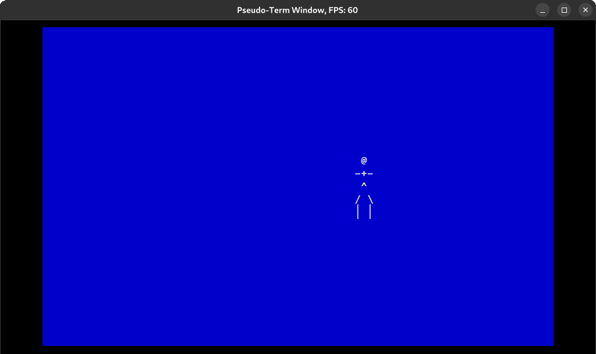

# Pseudo-Term

## Description

A simple game engine for ASCII art games.

Pseudo term is a library that provides a consistent terminal size and style, along with a system of game objects and rooms.

Define your game objects using the `GameObject` trait, organize them into rooms, add the rooms and global game objects to an environment and then run it.



## Build

It's a Rust project, so use cargo.

## Contributing

There are a few requirements for contributing. If your PR does not meet these requirements, then it will be rejected.

1. Match the code style of the file you're in or match the code style of the rest of the project when making a new file.
2. Sign your commits and use the following format:
   ```
   file_name: short message

   Optional detailed explanation of commits
   That can be multiline

   Signed-off-by: Your Name <your.email@whatever.com>
   ```

   You need to use this format as we use git commits to track history and only allow rebase PRs.

